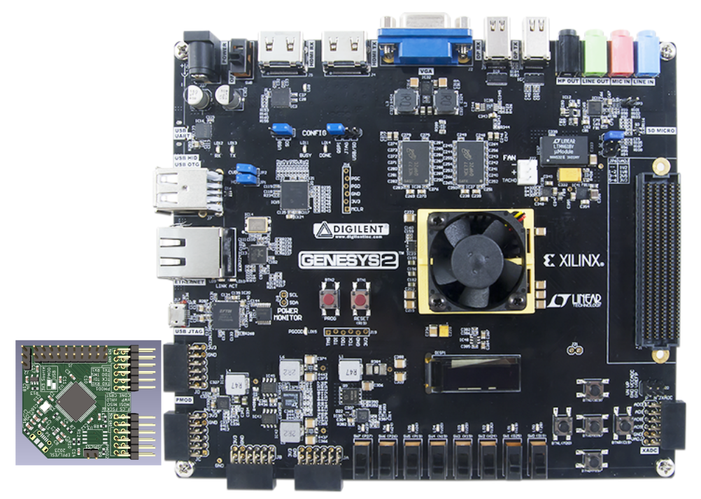

# FPGA Genesys2: Connection Guide

This section shows a diagram illustrating how to connect the EPFL X-HEEP programmer to the Genesys2 development board. Although the board provides two PMOD pairs, the programmer must be connected specifically to the interface shown in the image for attaching the external FTDI and flash memory.

